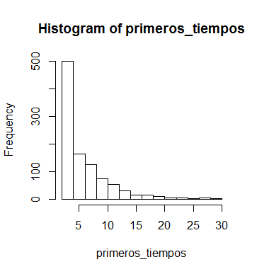

# clase-estadistica
ejercicios de estadistica

El primer ejercicio consiste en `escribir letras al azar` hasta la palabra deseada se escriba por primera vez y calcular el tiempo esperado, también estimar su distribución.

**HISTOGRAMA DEL TIEMPO ESPERADO PARA QUE LA PALABRA `AB` APAREZCA POR PRIMERA VEZ**

