tp\_regresion
================

Tenemos 1000 vinos a los cuales les medimos 11 variables de interés: fixed acidity, volatile acidity, citric acid, residual sugar, chlorides, free sulfur dioxide, total sulfur dioxide, density, pH, sulphates y alcohol. A su vez, cada uno de estos vinos fue calificado con una nota del 0 al 10 por unos especialistas (que al calificarlos tuvieron en cuenta ´unicamente su "experiencia sensorial"). Estos datos fueron guardados en la variable quality. El objetivo de este TP es poder explicar mediante una regresión lineal la variable respuesta quality en función de las 11 variables explicativas ya mencionadas.

``` r
# cargo los datos
library(caret)
## Loading required package: lattice
## Loading required package: ggplot2
library(glmnet)
## Loading required package: Matrix
## Loading required package: foreach
## Loaded glmnet 2.0-16
library(glmnetUtils)
## 
## Attaching package: 'glmnetUtils'
## The following objects are masked from 'package:glmnet':
## 
##     cv.glmnet, glmnet
vinos <- read.csv("vinos_1.csv",header=TRUE,sep=",")
```

PREPROCESAR
===========

``` r
boxplot(vinos)
```

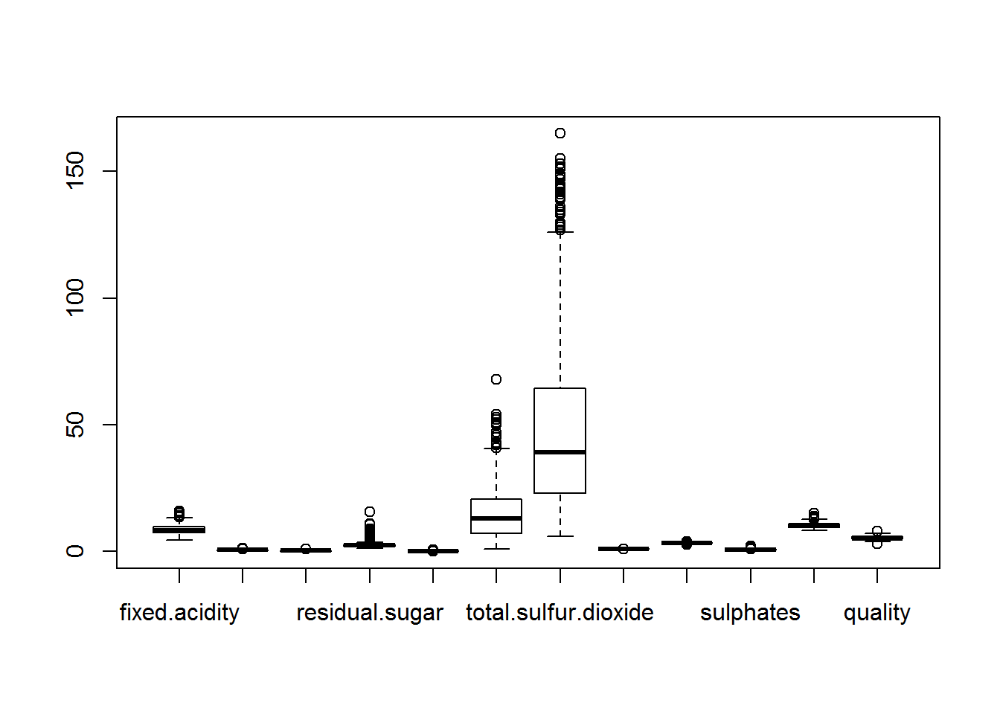

``` r
reemplazar_outliers=function(x){
  # reemplaza los outliers por el valor del quantile .02 y .98 segun corresponda.
  qnt <- quantile(x,probs=c(.25,.75))
  alfa <- quantile(x,probs=c(.02,0.98))
  H<-1.5*IQR(x)
  #x[x< (qnt[1]-H)]<-alfa[1]
  #x[x>(qnt[2]+H)]<-alfa[2]
  x[x<alfa[1]]<-alfa[1]
  x[x>alfa[2]]<-alfa[2]
  return(x)
}
preprocesar=function(data){
  
  for (i in 1:(length(data))){
    data[,i]=reemplazar_outliers(data[,i])
    #data[,i]=as.numeric(scale(data[,i],center= TRUE, scale= TRUE))
  }
  return(data)
}
# reemplazo los outliers en todas las columnas
data <- preprocesar(vinos)
boxplot(data)
```

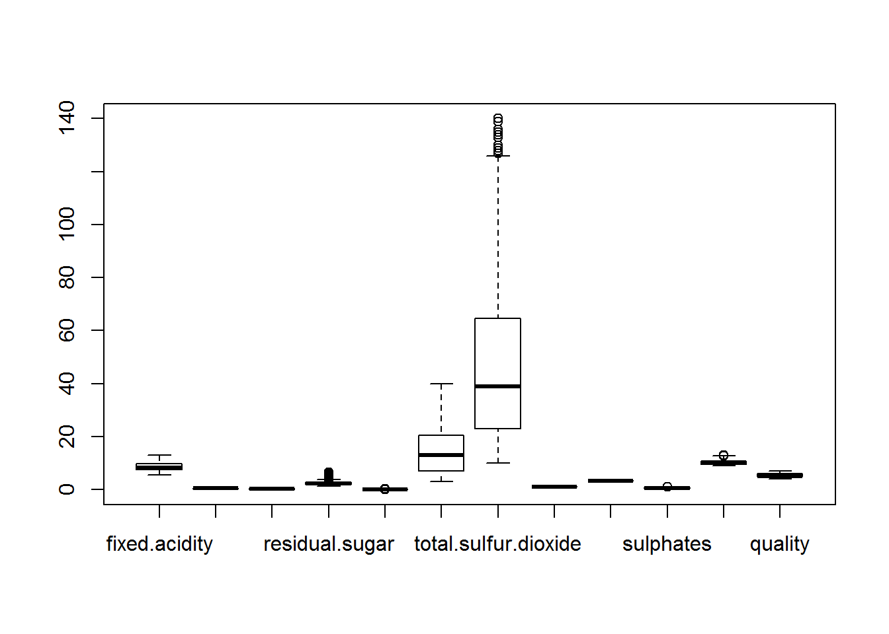

VISUALIZACIÓN
=============

``` r
plot(data)
```

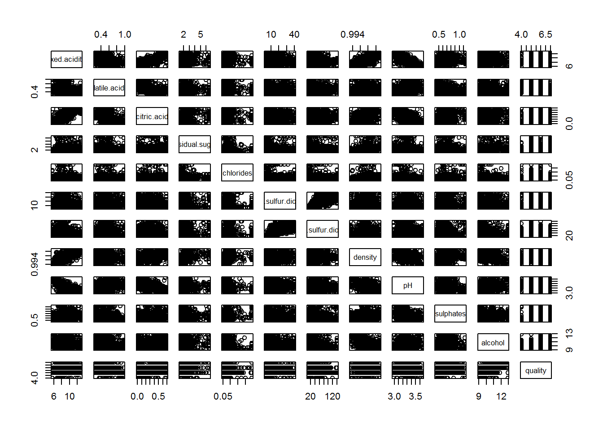

``` r
# hago scatter plots para visualizar la relacion entre quality y las variables
graficar <- function(variable){
  scatter.smooth(variable,y=data$quality,main= "quality ~",lpars =
                   list(col = "red", lwd = 3, lty = 3))
}
cor(data$quality,data$fixed.acidity)
## [1] 0.1871986
graficar(data$fixed.acidity)
```

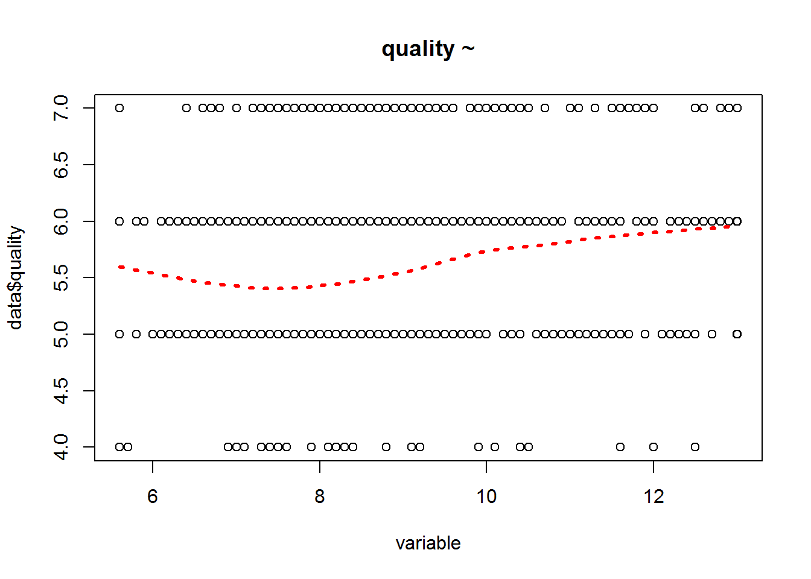

``` r
cor(data$quality,data$volatile.acidity)
## [1] -0.3467689
graficar(data$volatile.acidity)
```

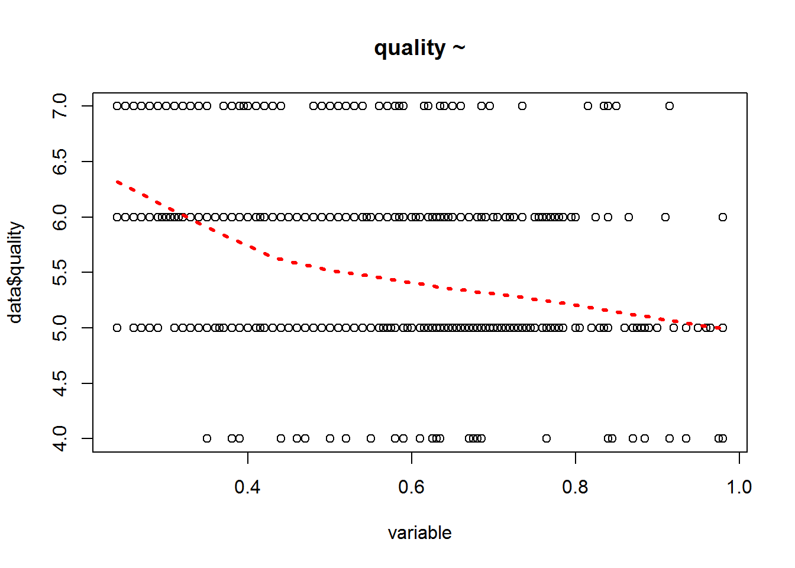

``` r
cor(data$quality,data$citric.acid)
## [1] 0.2251633
graficar(data$citric.acid)
```

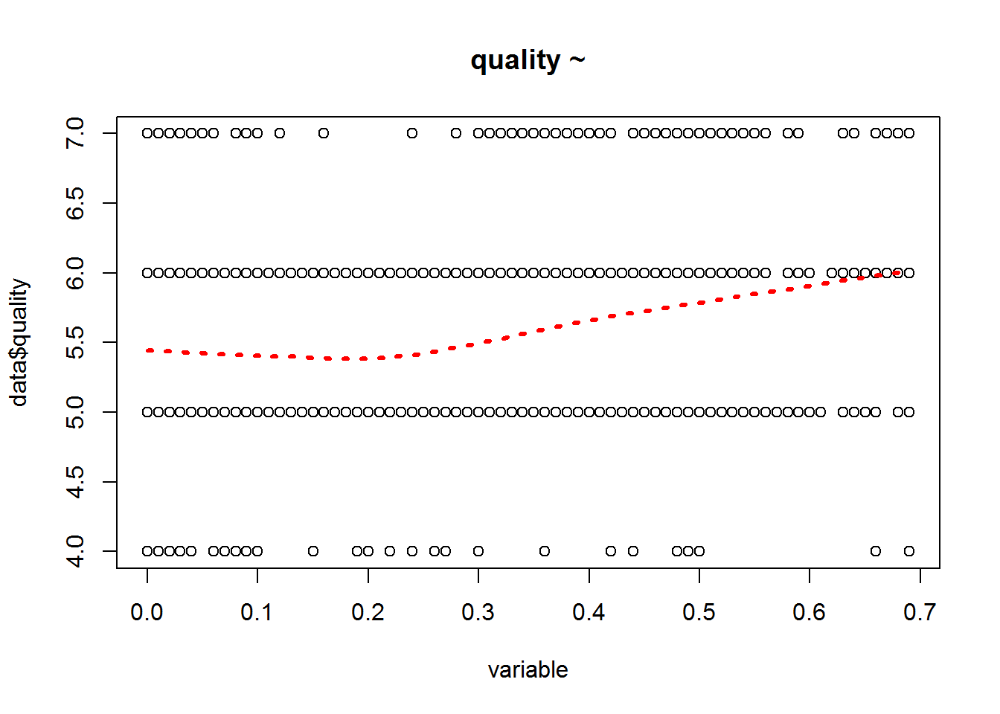

``` r
cor(data$quality,data$total.sulfur.dioxide)
## [1] -0.258991
graficar(data$total.sulfur.dioxide)
```

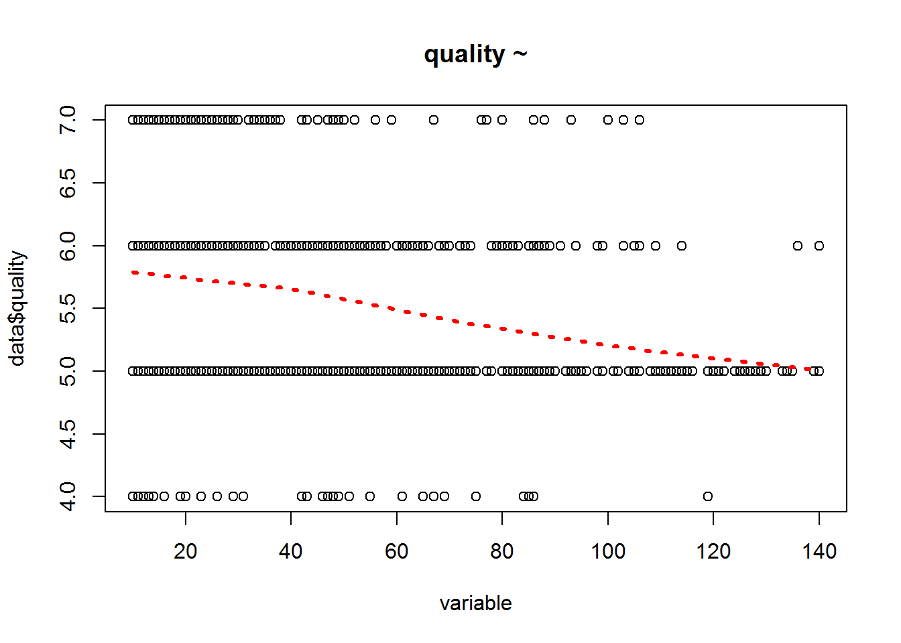

``` r
cor(data$alcohol,data$quality)
## [1] 0.4904445
graficar(data$alcohol)
```

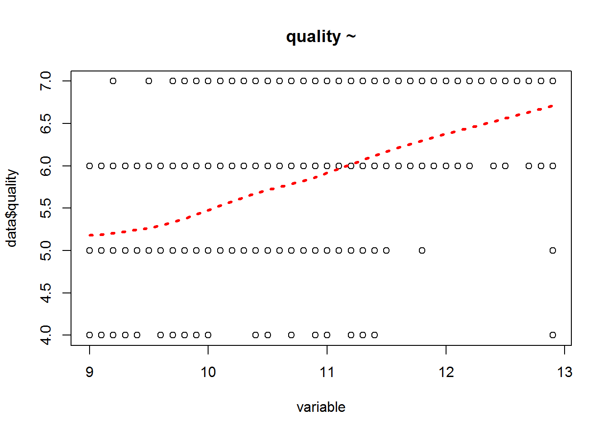

MODELOS
=======

``` r
set.seed(42)
```

### SEPARO EN TRAIN Y TEST

``` r
Y <- vinos[,"quality"]
train_indices<-createDataPartition(Y,p=0.8,list=FALSE) # mantiene la proporción de las clases de Y
vinos_train<- data[train_indices,]
vinos_test <- data[-train_indices,]
vinos_test_original<-vinos[-train_indices,]
```

En cada modelo voy a ver el MSE de vinos\_train, vinos\_test y tambien MSE vinos\_test\_original porque aunque quiero entrenar el modelo con datos que no tengan outliers en "quality", la variable quality de vinos\_2 seguramente tambien tenga outliers y por lo tanto para testear el modelo puede ser conveniente darle más importancia al error de la prediccion con la variable quality original.

### MODELO 1

El primer modelo consiste en simplemente entrenar al modelo lineal usando todas las variables.

``` r
# defino train control para k fold cross validation
train_control<-trainControl(method = "cv",number = 10)
# entreno el modelo lineal
vinos.fit <-train(quality ~., data = vinos_train, trControl=train_control, method = "lm")
# medidas promedio de los 10 folds. En particular MSE es la medida que uso para decidir cual
# es el modelo lineal que mejor ajusta
vinos.fit$results
##   intercept      RMSE  Rsquared       MAE    RMSESD RsquaredSD     MAESD
## 1      TRUE 0.6121056 0.3479371 0.4868475 0.0388219 0.05941545 0.0265105
# calculo MSE del modelo con vinos_train
MSE=(vinos.fit$results$RMSE)^2
MSE
## [1] 0.3746732
# resumen del modelo final
modeloFinal1 <- vinos.fit$finalModel
summary(modeloFinal1)
## 
## Call:
## lm(formula = .outcome ~ ., data = dat)
## 
## Residuals:
##      Min       1Q   Median       3Q      Max 
## -2.16807 -0.36820 -0.07791  0.45989  1.74947 
## 
## Coefficients:
##                        Estimate Std. Error t value Pr(>|t|)    
## (Intercept)           14.096789  29.438357   0.479 0.632172    
## fixed.acidity          0.042727   0.035064   1.219 0.223381    
## volatile.acidity      -0.891218   0.165038  -5.400 8.82e-08 ***
## citric.acid           -0.395136   0.192837  -2.049 0.040786 *  
## residual.sugar         0.021170   0.027002   0.784 0.433253    
## chlorides             -1.363211   0.743217  -1.834 0.067000 .  
## free.sulfur.dioxide    0.002413   0.003430   0.704 0.481899    
## total.sulfur.dioxide  -0.003875   0.001042  -3.719 0.000214 ***
## density              -11.129089  30.010592  -0.371 0.710857    
## pH                    -0.171154   0.253223  -0.676 0.499301    
## sulphates              0.822383   0.159529   5.155 3.21e-07 ***
## alcohol                0.297653   0.034899   8.529  < 2e-16 ***
## ---
## Signif. codes:  0 '***' 0.001 '**' 0.01 '*' 0.05 '.' 0.1 ' ' 1
## 
## Residual standard error: 0.6081 on 789 degrees of freedom
## Multiple R-squared:  0.3589, Adjusted R-squared:   0.35 
## F-statistic: 40.16 on 11 and 789 DF,  p-value: < 2.2e-16
plot(modeloFinal1$fitted.values,modeloFinal1$residuals)
```

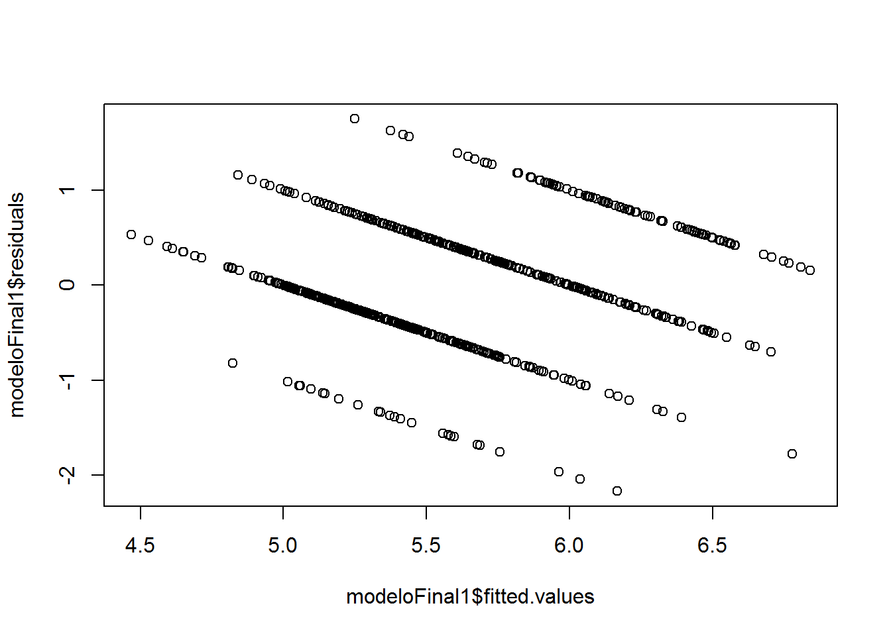

``` r
prediccion<-predict(modeloFinal1,vinos_test)
MSE<-mean((vinos_test[,"quality"]-prediccion)^2)
MSE
## [1] 0.3886103
prediccion<-predict(modeloFinal1,vinos_test)
MSE<-mean((vinos_test_original[,"quality"]-prediccion)^2)
MSE
## [1] 0.4636838
```

### MISMO MODELO CON REGRESION LINEAL PENALIZADA

El primer modelo puede pensarse como regresión lineal penalizada con lambda=0

``` r
### PRUEBO EL MISMO MODELO CON REGRESIÓN LINEAL PENALIZADA
foldid=sample(1:10,size=length(vinos_train[,"quality"]),replace=TRUE)
# realizo cross-validation para elegir lambda con 3 valores de alpha fijos.
cv.alpha0 <- cv.glmnet(quality~ ., data=vinos_train,foldid=foldid,alpha=0) # Ridge
cv.alpha05 <- cv.glmnet(quality~ ., data=vinos_train,foldid=foldid,alpha=0.5)
cv.alpha1 <- cv.glmnet(quality~ ., data=vinos_train,foldid=foldid,alpha=1) # Lasso
plot(cv.alpha0)
```

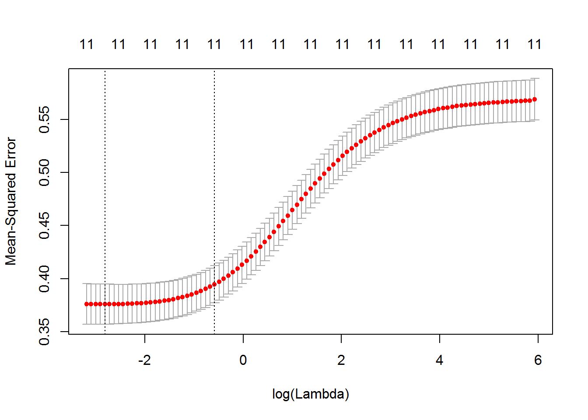

``` r
plot(cv.alpha05)
```

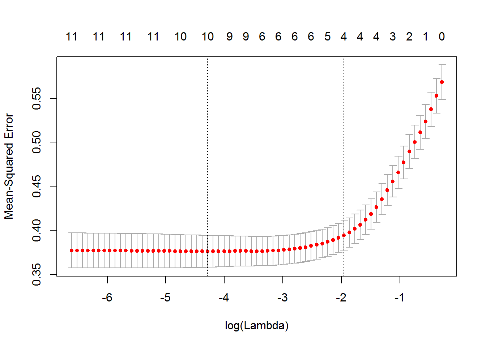

``` r
plot(cv.alpha1)
```

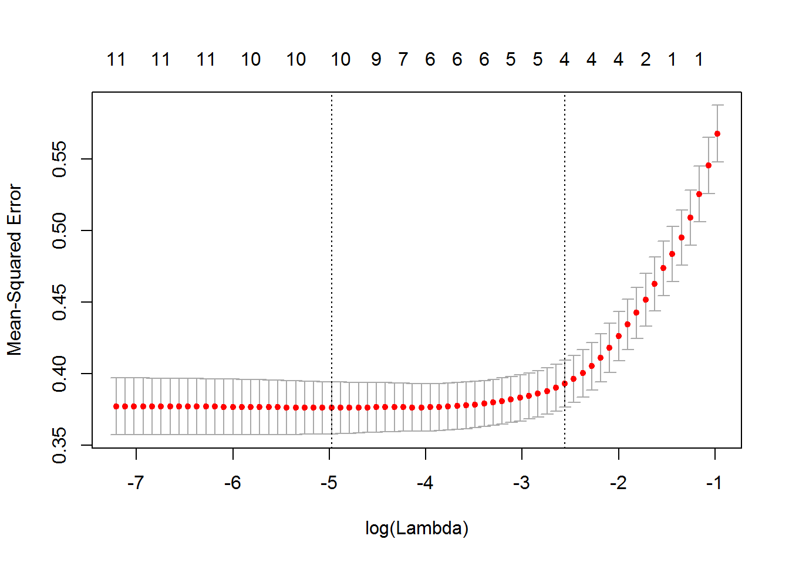

Elijo el modelo con alpha=1 y lambda = lambda.1se porque este tiene solo 4 variables diferente de 0 y el MSE es similar al del lambda que minimiza el MSE en vinos\_train. Los coeficientes no nulos son los siguientes

``` r
coef(cv.alpha1, s="lambda.1se")
## 12 x 1 sparse Matrix of class "dgCMatrix"
##                                 1
## (Intercept)           3.084365962
## fixed.acidity         .          
## volatile.acidity     -0.573510077
## citric.acid           .          
## residual.sugar        .          
## chlorides             .          
## free.sulfur.dioxide   .          
## total.sulfur.dioxide -0.001796779
## density               .          
## pH                    .          
## sulphates             0.347407465
## alcohol               0.260739872
```

El MSE para vinos\_test es

``` r
prediccion <-predict(cv.alpha1, newdata=vinos_test, s = "lambda.1se")
MSE<-mean((vinos_test[,"quality"]-prediccion)^2)
MSE
## [1] 0.4226353
prediccion <-predict(cv.alpha1, newdata=vinos_test, s = "lambda.1se")
MSE<-mean((vinos_test_original[,"quality"]-prediccion)^2)
MSE
## [1] 0.5090464
```

### MODELO 2

El segundo modelo utiliza las variables que tienen p-valor más chico que 0.05 en el MODELO 1 y también utiliza intercept. El modelo intenta explicar quality a partir de volatile.acidity,citric.acid, chlorides, total.sulfur.dioxide, sulphates, alcohol.

``` r
# defino train control para k fold cross validation
train_control<-trainControl(method = "cv",number = 10)
# entreno el modelo lineal
vinos.fit <-train(quality ~ volatile.acidity + citric.acid + chlorides + total.sulfur.dioxide + sulphates + alcohol,
                   data = vinos_train, trControl=train_control,method ="lm")                  
# medidas promedio de los 10 folds.
vinos.fit$results
##   intercept      RMSE  Rsquared       MAE     RMSESD RsquaredSD      MAESD
## 1      TRUE 0.6107483 0.3541866 0.4883394 0.04443321 0.07329282 0.03364853
# calculo MSE del modelo con vinos_train
MSE=(vinos.fit$results$RMSE)^2
MSE
## [1] 0.3730134
# resumen del modelo final
modeloFinal2 <- vinos.fit$finalModel
summary(modeloFinal2)
## 
## Call:
## lm(formula = .outcome ~ ., data = dat)
## 
## Residuals:
##      Min       1Q   Median       3Q      Max 
## -2.30502 -0.38336 -0.07395  0.45428  1.72904 
## 
## Coefficients:
##                        Estimate Std. Error t value Pr(>|t|)    
## (Intercept)           2.7307606  0.2814077   9.704  < 2e-16 ***
## volatile.acidity     -0.8224216  0.1595299  -5.155 3.20e-07 ***
## citric.acid          -0.0518513  0.1368338  -0.379   0.7048    
## chlorides            -1.4998034  0.7131621  -2.103   0.0358 *  
## total.sulfur.dioxide -0.0036257  0.0006803  -5.330 1.28e-07 ***
## sulphates             0.8491884  0.1565007   5.426 7.65e-08 ***
## alcohol               0.2985125  0.0232106  12.861  < 2e-16 ***
## ---
## Signif. codes:  0 '***' 0.001 '**' 0.01 '*' 0.05 '.' 0.1 ' ' 1
## 
## Residual standard error: 0.6096 on 794 degrees of freedom
## Multiple R-squared:  0.3518, Adjusted R-squared:  0.3469 
## F-statistic: 71.81 on 6 and 794 DF,  p-value: < 2.2e-16
plot(modeloFinal2$fitted.values,modeloFinal2$residuals)
```

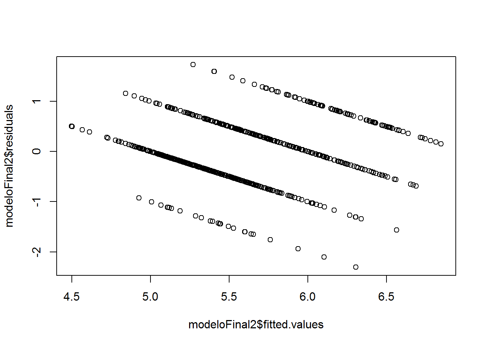

``` r
prediccion<-predict(modeloFinal2,vinos_test)
MSE<-mean((vinos_test[,"quality"]-prediccion)^2)
MSE
## [1] 0.3898927
prediccion<-predict(modeloFinal2,vinos_test)
MSE<-mean((vinos_test_original[,"quality"]-prediccion)^2)
MSE
## [1] 0.4652834
```

Este modelo no solo obtiene un RME en en vinos\_test similar al del modelo1, sino que lo hace explicando quality con variables para las cuales se tiene evidencia de que el parametro que las acompaña no es 0. Al disminuir la cantidad de variables y restringirnos a utilizar aquellas que son significativas, sería razonable que esto ayude a que overfitting no sea un problema.

MODELO 3
--------

El modelo se usa las variables del modelo 2 pero agrega dependencia cuadratrica de las mismas.

``` r
foldid=sample(1:10,size=length(vinos_train[,"quality"]),replace=TRUE)
# realizo cross-validation para elegir lambda con 3 valores de alpha fijos.
cv.alpha0 <- cv.glmnet(quality~ volatile.acidity + citric.acid +chlorides + total.sulfur.dioxide + sulphates + alcohol + I(volatile.acidity^2) + I(citric.acid^2)+ I(chlorides^2) + I(total.sulfur.dioxide^2)+ I(sulphates^2) + I(alcohol^2), data=vinos_train,foldid=foldid,alpha=0) # Ridge
cv.alpha05 <- cv.glmnet(quality~ volatile.acidity + citric.acid +chlorides + total.sulfur.dioxide + sulphates + alcohol + I(volatile.acidity^2) + I(citric.acid^2)+ I(chlorides^2) + I(total.sulfur.dioxide^2)+ I(sulphates^2) + I(alcohol^2), data=vinos_train,foldid=foldid,alpha=0.5)
cv.alpha1 <- cv.glmnet(quality~ volatile.acidity + citric.acid +chlorides + total.sulfur.dioxide + sulphates + alcohol + I(volatile.acidity^2) + I(citric.acid^2)+ I(chlorides^2) + I(total.sulfur.dioxide^2)+ I(sulphates^2) + I(alcohol^2), data=vinos_train,foldid=foldid,alpha=1) # Lasso
plot(cv.alpha0)
```

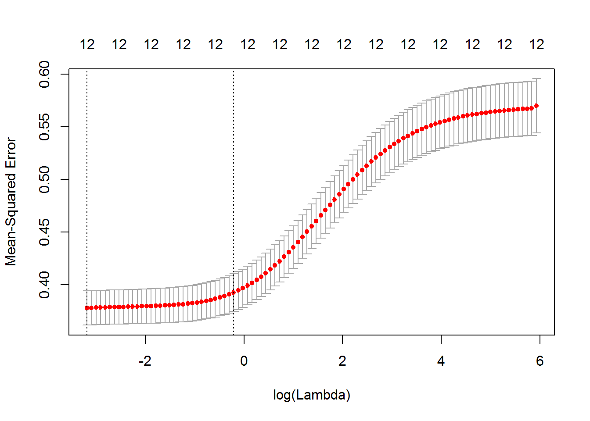

``` r
plot(cv.alpha05)
```

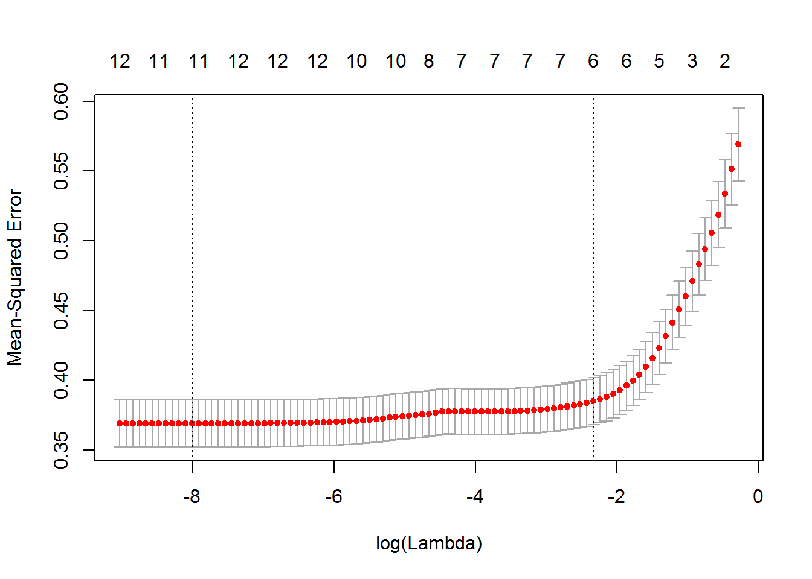

``` r
plot(cv.alpha1)
```

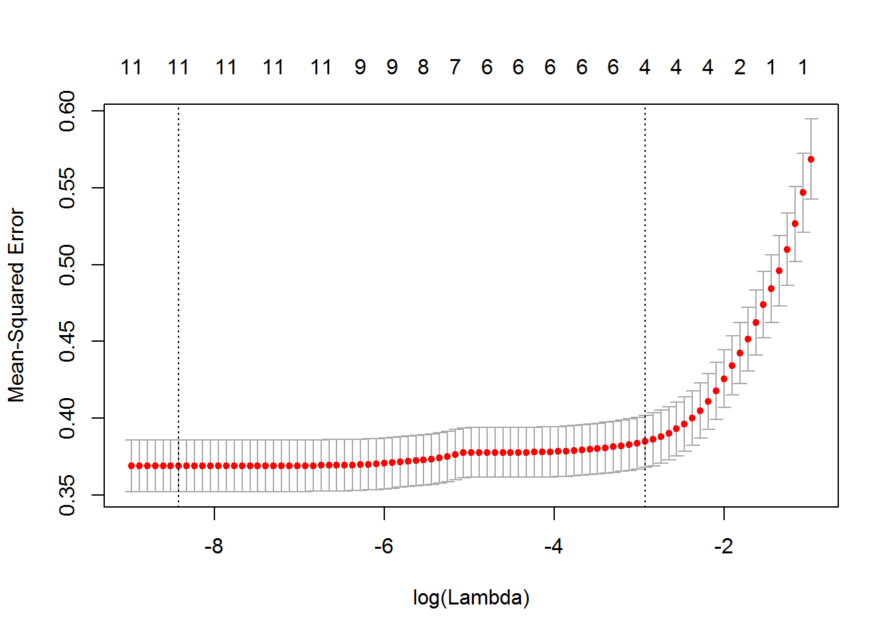 Elijo el modelo con alpha=0.5 y lambda = lambda.min. Los coeficientes no nulos son los siguientes

``` r
coef(cv.alpha05, s="lambda.min")
## 13 x 1 sparse Matrix of class "dgCMatrix"
##                                       1
## (Intercept)                1.629615e+00
## volatile.acidity          -2.229121e+00
## citric.acid               -2.742441e-01
## chlorides                 -3.017258e+00
## total.sulfur.dioxide      -2.489851e-03
## sulphates                  5.848224e+00
## alcohol                    2.734659e-01
## I(volatile.acidity^2)      1.240642e+00
## I(citric.acid^2)           2.566183e-01
## I(chlorides^2)             7.770771e+00
## I(total.sulfur.dioxide^2) -5.215334e-06
## I(sulphates^2)            -3.313011e+00
## I(alcohol^2)               .
```

El MSE para vinos\_test es

``` r
prediccion <-predict(cv.alpha05, newdata=vinos_test, s = "lambda.min")
MSE<-mean((vinos_test[,"quality"]-prediccion)^2)
MSE
## [1] 0.3959355
prediccion <-predict(cv.alpha05, newdata=vinos_test, s = "lambda.min")
MSE<-mean((vinos_test_original[,"quality"]-prediccion)^2)
MSE
## [1] 0.4703662
```

MODELO 4
--------

En este modelo, considero que el logaritmo(quality) depende linealmente de las variables.

``` r
# defino train control para k fold cross validation
train_control<-trainControl(method = "cv",number = 10)
# entreno el modelo lineal
vinos.fit <-train(log(quality) ~.,
                   data = vinos_train, trControl=train_control,method ="lm")                  
# medidas promedio de los 10 folds. 
vinos.fit$results
##   intercept      RMSE  Rsquared       MAE      RMSESD RsquaredSD
## 1      TRUE 0.1104847 0.3218659 0.0869985 0.009270074 0.06633085
##         MAESD
## 1 0.005870093
# resumen del modelo final
modeloFinal4 <- vinos.fit$finalModel
summary(modeloFinal4)
## 
## Call:
## lm(formula = .outcome ~ ., data = dat)
## 
## Residuals:
##      Min       1Q   Median       3Q      Max 
## -0.42354 -0.06405 -0.01055  0.08195  0.29668 
## 
## Coefficients:
##                        Estimate Std. Error t value Pr(>|t|)    
## (Intercept)           0.6763220  5.3006338   0.128 0.898504    
## fixed.acidity         0.0055761  0.0063135   0.883 0.377403    
## volatile.acidity     -0.1642856  0.0297165  -5.528 4.39e-08 ***
## citric.acid          -0.0766805  0.0347220  -2.208 0.027502 *  
## residual.sugar        0.0022164  0.0048619   0.456 0.648610    
## chlorides            -0.2474292  0.1338227  -1.849 0.064841 .  
## free.sulfur.dioxide   0.0004292  0.0006176   0.695 0.487317    
## total.sulfur.dioxide -0.0006679  0.0001876  -3.559 0.000394 ***
## density               0.6474854  5.4036698   0.120 0.904654    
## pH                   -0.0433704  0.0455949  -0.951 0.341789    
## sulphates             0.1396478  0.0287246   4.862 1.41e-06 ***
## alcohol               0.0531101  0.0062838   8.452  < 2e-16 ***
## ---
## Signif. codes:  0 '***' 0.001 '**' 0.01 '*' 0.05 '.' 0.1 ' ' 1
## 
## Residual standard error: 0.1095 on 789 degrees of freedom
## Multiple R-squared:  0.3402, Adjusted R-squared:  0.331 
## F-statistic: 36.98 on 11 and 789 DF,  p-value: < 2.2e-16
# MSE de train_vinos
MSE <- mean((vinos_train[,"quality"]-exp(modeloFinal4$fitted.values))^2)
MSE
## [1] 0.3638155
plot(modeloFinal4$fitted.values,modeloFinal4$residuals)
```

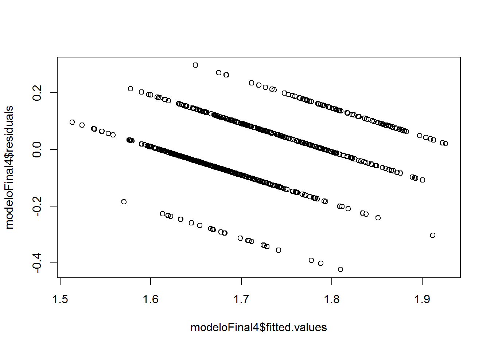

``` r
# MSE de test_vinos
MSE <- mean((vinos_test[,"quality"]-exp(predict(modeloFinal4,vinos_test)))^2)
MSE
## [1] 0.3889965
MSE <- mean((vinos_test_original[,"quality"]-exp(predict(modeloFinal4,vinos_test)))^2)
MSE
## [1] 0.4649471
```

MODELO 5
--------

El último modelo considera "volatile.acidity", "citric.acid", "chlorides", "total.sulfur.dioxide", "sulphates","alcohol","pH" y el producto de estas variables.

``` r
vinos_train5 <- vinos_train[,match(c("volatile.acidity","citric.acid","chlorides","total.sulfur.dioxide","sulphates","alcohol","pH","quality"),colnames(vinos))]
vinos_test5 <- vinos_test[,match(c("volatile.acidity","citric.acid","chlorides","total.sulfur.dioxide","sulphates","alcohol","pH","quality"),colnames(vinos))]
l=1
for (i in 1:6){
  for (j in (i+1):7){
    vinos_train5[,8+l]<-vinos_train5[,i]*vinos_train5[,j]
    vinos_test5[,8+l]<-vinos_test5[,i]*vinos_test5[,j]
    l<-l+1
  }
}
foldid=sample(1:10,size=length(vinos_train5[,"quality"]),replace=TRUE)
cv.alpha0 <- cv.glmnet(quality~ ., data=vinos_train5,foldid=foldid,alpha=0) # Ridge
cv.alpha05 <- cv.glmnet(quality~ ., data=vinos_train5,foldid=foldid,alpha=0.5)
cv.alpha1 <- cv.glmnet(quality~ ., data=vinos_train5,foldid=foldid,alpha=1) # Lasso
plot(cv.alpha0)
```

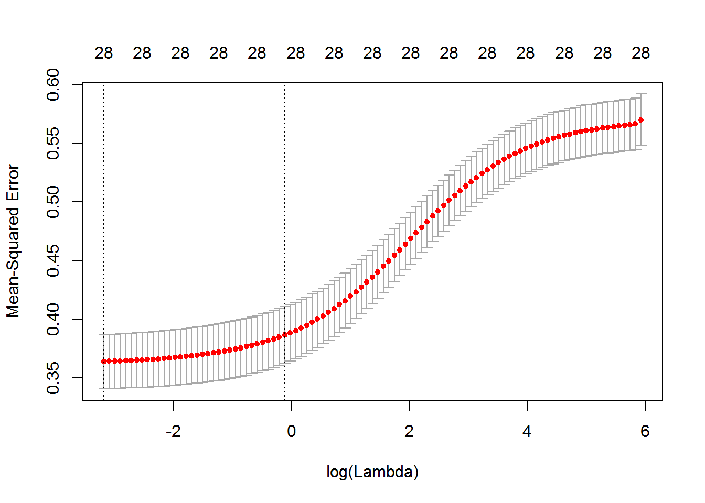

``` r
plot(cv.alpha05)
```

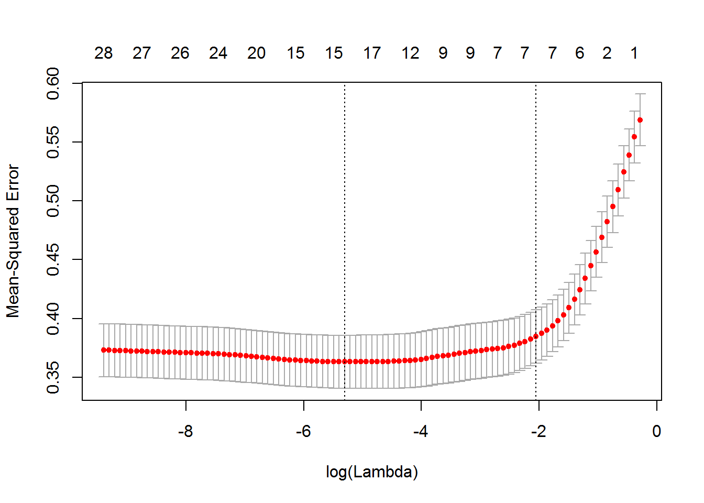

``` r
plot(cv.alpha1)
```

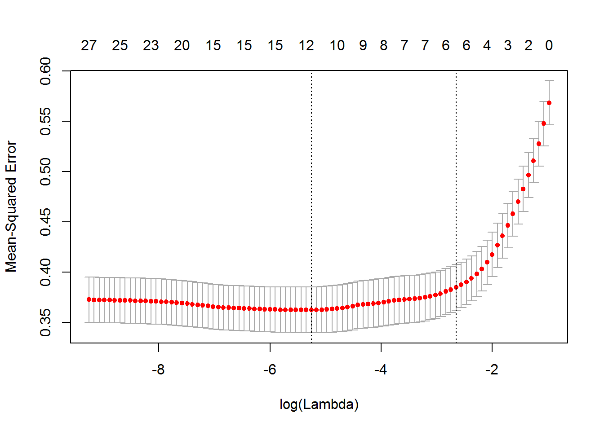

Elijo el modelo con alpha=1 y lambda = lambda.min

``` r
#MSE vinos_train
MSE<-cv.alpha1$cvm[match(cv.alpha1$lambda.min,cv.alpha1$lambda)]
MSE
## [1] 0.3624052
coef(cv.alpha1, s="lambda.min")
## 29 x 1 sparse Matrix of class "dgCMatrix"
##                                 1
## (Intercept)           4.626972708
## volatile.acidity     -1.014357590
## citric.acid           .          
## chlorides             .          
## total.sulfur.dioxide  .          
## sulphates             .          
## alcohol               0.204341385
## pH                   -0.386978947
## V9                   -0.257941113
## V10                   .          
## V11                   0.006460861
## V12                  -0.042411713
## V13                   .          
## V14                   .          
## V15                  -1.461285064
## V16                  -0.000647272
## V17                   .          
## V18                   .          
## V19                   .          
## V20                   .          
## V21                  -1.055452962
## V22                   .          
## V23                   .          
## V24                  -0.010413422
## V25                   .          
## V26                   .          
## V27                   0.148159606
## V28                   .          
## V29                   .
```

El MSE para vinos\_test es

``` r
prediccion <-predict(cv.alpha1, newdata=vinos_test5, s = "lambda.min")
MSE<-mean((vinos_test5[,"quality"]-prediccion)^2)
MSE
## [1] 0.3891322
prediccion <-predict(cv.alpha1, newdata=vinos_test5, s = "lambda.min")
MSE<-mean((vinos_test_original[,"quality"]-prediccion)^2)
MSE
## [1] 0.4594374
```

ELECCION DE MODELO
==================

como el MSE de vinos\_test para el modelo5 es el mas chico, elijo este como el modelo final

``` r
vinos_prediccion <- read.csv("vinos_2.csv",header=TRUE,sep=",")
preprocesa=function(data){
  
  for (i in 1:(length(data))){
    data[,i]=reemplazar_outliers(data[,i])
  }
  return(data)
}
vinos_prediccion <- preprocesa(vinos_prediccion)
x=c("volatile.acidity","citric.acid","chlorides","total.sulfur.dioxide","sulphates","alcohol","pH")
vinos_p <- vinos_prediccion[,x]
vinos_p[,"quality"]<-1:599 # pongo cualquier cosa solo para que tenga "quality"
l<-1
for (i in 1:6){
  for (j in (i+1):7){
    vinos_p[,8+l]<-vinos_p[,i]*vinos_p[,j]
    vinos_p[,8+l]<-vinos_p[,i]*vinos_p[,j]
    l<-l+1
  }
}
predichos <-predict(cv.alpha1, newdata=vinos_p, s = "lambda.min")
round(predichos,3)
##            1
##   [1,] 6.257
##   [2,] 6.029
##   [3,] 6.606
##   [4,] 6.483
##   [5,] 5.603
##   [6,] 6.483
##   [7,] 6.606
##   [8,] 6.607
##   [9,] 6.400
##  [10,] 5.785
##  [11,] 6.428
##  [12,] 5.851
##  [13,] 5.106
##  [14,] 5.383
##  [15,] 5.885
##  [16,] 6.442
##  [17,] 6.649
##  [18,] 6.214
##  [19,] 6.214
##  [20,] 5.648
##  [21,] 6.112
##  [22,] 6.112
##  [23,] 5.710
##  [24,] 6.358
##  [25,] 5.664
##  [26,] 5.427
##  [27,] 6.365
##  [28,] 5.666
##  [29,] 5.516
##  [30,] 5.664
##  [31,] 5.899
##  [32,] 5.855
##  [33,] 5.136
##  [34,] 5.646
##  [35,] 5.173
##  [36,] 5.990
##  [37,] 6.434
##  [38,] 4.950
##  [39,] 6.566
##  [40,] 6.099
##  [41,] 5.292
##  [42,] 5.547
##  [43,] 6.099
##  [44,] 6.098
##  [45,] 6.229
##  [46,] 6.030
##  [47,] 5.590
##  [48,] 5.641
##  [49,] 6.108
##  [50,] 6.033
##  [51,] 5.641
##  [52,] 5.403
##  [53,] 6.207
##  [54,] 6.759
##  [55,] 5.109
##  [56,] 5.109
##  [57,] 6.176
##  [58,] 5.168
##  [59,] 6.032
##  [60,] 6.176
##  [61,] 6.022
##  [62,] 6.566
##  [63,] 6.125
##  [64,] 6.339
##  [65,] 5.918
##  [66,] 5.559
##  [67,] 6.475
##  [68,] 6.489
##  [69,] 6.489
##  [70,] 5.604
##  [71,] 6.377
##  [72,] 5.021
##  [73,] 5.303
##  [74,] 5.576
##  [75,] 5.021
##  [76,] 5.789
##  [77,] 6.427
##  [78,] 5.955
##  [79,] 5.955
##  [80,] 6.017
##  [81,] 6.293
##  [82,] 6.017
##  [83,] 5.302
##  [84,] 6.235
##  [85,] 5.302
##  [86,] 5.393
##  [87,] 6.319
##  [88,] 6.277
##  [89,] 5.728
##  [90,] 5.728
##  [91,] 6.156
##  [92,] 6.094
##  [93,] 5.977
##  [94,] 6.629
##  [95,] 5.470
##  [96,] 5.704
##  [97,] 5.470
##  [98,] 5.296
##  [99,] 6.683
## [100,] 5.296
## [101,] 6.671
## [102,] 6.194
## [103,] 5.835
## [104,] 6.194
## [105,] 6.375
## [106,] 6.242
## [107,] 6.462
## [108,] 6.605
## [109,] 5.069
## [110,] 5.694
## [111,] 5.716
## [112,] 6.113
## [113,] 6.110
## [114,] 5.781
## [115,] 6.271
## [116,] 5.797
## [117,] 5.797
## [118,] 5.797
## [119,] 6.461
## [120,] 6.257
## [121,] 6.622
## [122,] 6.187
## [123,] 6.101
## [124,] 6.104
## [125,] 5.931
## [126,] 6.245
## [127,] 6.560
## [128,] 5.735
## [129,] 5.431
## [130,] 5.678
## [131,] 5.802
## [132,] 5.235
## [133,] 6.852
## [134,] 6.085
## [135,] 6.566
## [136,] 6.191
## [137,] 6.210
## [138,] 6.210
## [139,] 5.197
## [140,] 5.230
## [141,] 5.280
## [142,] 5.986
## [143,] 6.211
## [144,] 6.009
## [145,] 5.556
## [146,] 5.895
## [147,] 5.764
## [148,] 6.059
## [149,] 6.161
## [150,] 6.235
## [151,] 6.877
## [152,] 6.140
## [153,] 5.342
## [154,] 5.988
## [155,] 5.829
## [156,] 5.342
## [157,] 6.109
## [158,] 6.381
## [159,] 6.009
## [160,] 5.893
## [161,] 6.186
## [162,] 5.865
## [163,] 6.487
## [164,] 5.397
## [165,] 5.397
## [166,] 5.592
## [167,] 5.847
## [168,] 6.652
## [169,] 6.222
## [170,] 6.050
## [171,] 6.036
## [172,] 5.783
## [173,] 6.542
## [174,] 5.330
## [175,] 5.330
## [176,] 5.868
## [177,] 5.418
## [178,] 6.415
## [179,] 5.668
## [180,] 6.131
## [181,] 6.131
## [182,] 5.949
## [183,] 5.881
## [184,] 5.207
## [185,] 5.499
## [186,] 5.939
## [187,] 5.781
## [188,] 5.939
## [189,] 5.499
## [190,] 4.969
## [191,] 6.304
## [192,] 5.271
## [193,] 6.610
## [194,] 5.271
## [195,] 5.174
## [196,] 5.302
## [197,] 5.204
## [198,] 5.489
## [199,] 6.041
## [200,] 5.204
## [201,] 5.489
## [202,] 6.054
## [203,] 6.292
## [204,] 5.118
## [205,] 6.107
## [206,] 6.107
## [207,] 6.107
## [208,] 5.376
## [209,] 6.107
## [210,] 6.297
## [211,] 5.644
## [212,] 5.359
## [213,] 5.644
## [214,] 6.109
## [215,] 5.788
## [216,] 6.053
## [217,] 5.240
## [218,] 6.321
## [219,] 5.961
## [220,] 6.123
## [221,] 6.157
## [222,] 6.157
## [223,] 5.206
## [224,] 6.514
## [225,] 6.083
## [226,] 5.264
## [227,] 5.278
## [228,] 5.505
## [229,] 6.354
## [230,] 5.322
## [231,] 6.360
## [232,] 5.510
## [233,] 5.322
## [234,] 5.493
## [235,] 5.949
## [236,] 5.786
## [237,] 5.505
## [238,] 5.949
## [239,] 5.139
## [240,] 5.923
## [241,] 5.162
## [242,] 5.487
## [243,] 6.272
## [244,] 5.186
## [245,] 5.418
## [246,] 5.673
## [247,] 5.330
## [248,] 5.673
## [249,] 6.048
## [250,] 5.754
## [251,] 5.754
## [252,] 5.380
## [253,] 5.294
## [254,] 5.290
## [255,] 5.752
## [256,] 5.540
## [257,] 5.139
## [258,] 5.729
## [259,] 5.831
## [260,] 5.831
## [261,] 5.186
## [262,] 5.450
## [263,] 5.424
## [264,] 5.096
## [265,] 6.220
## [266,] 5.589
## [267,] 5.589
## [268,] 6.481
## [269,] 5.292
## [270,] 6.449
## [271,] 6.536
## [272,] 5.968
## [273,] 5.809
## [274,] 5.199
## [275,] 5.777
## [276,] 5.133
## [277,] 6.255
## [278,] 5.367
## [279,] 5.133
## [280,] 6.280
## [281,] 5.650
## [282,] 5.650
## [283,] 5.758
## [284,] 5.413
## [285,] 5.812
## [286,] 5.707
## [287,] 6.383
## [288,] 6.170
## [289,] 5.426
## [290,] 5.426
## [291,] 5.688
## [292,] 5.817
## [293,] 6.389
## [294,] 5.193
## [295,] 5.817
## [296,] 5.220
## [297,] 5.220
## [298,] 6.184
## [299,] 6.102
## [300,] 5.205
## [301,] 6.126
## [302,] 5.779
## [303,] 6.371
## [304,] 5.915
## [305,] 5.000
## [306,] 5.226
## [307,] 5.271
## [308,] 5.633
## [309,] 5.271
## [310,] 5.200
## [311,] 5.226
## [312,] 6.390
## [313,] 5.189
## [314,] 5.492
## [315,] 5.471
## [316,] 5.233
## [317,] 6.013
## [318,] 6.215
## [319,] 5.233
## [320,] 4.960
## [321,] 5.310
## [322,] 6.013
## [323,] 6.127
## [324,] 6.125
## [325,] 5.724
## [326,] 5.724
## [327,] 5.724
## [328,] 5.724
## [329,] 5.265
## [330,] 5.233
## [331,] 5.233
## [332,] 4.866
## [333,] 5.523
## [334,] 5.147
## [335,] 5.172
## [336,] 6.343
## [337,] 5.320
## [338,] 5.320
## [339,] 5.320
## [340,] 5.658
## [341,] 5.658
## [342,] 5.658
## [343,] 5.567
## [344,] 5.658
## [345,] 5.896
## [346,] 5.634
## [347,] 5.866
## [348,] 5.158
## [349,] 5.158
## [350,] 5.640
## [351,] 5.320
## [352,] 5.905
## [353,] 5.376
## [354,] 5.376
## [355,] 5.446
## [356,] 5.541
## [357,] 5.535
## [358,] 5.687
## [359,] 5.066
## [360,] 5.685
## [361,] 5.688
## [362,] 5.202
## [363,] 5.685
## [364,] 5.077
## [365,] 5.889
## [366,] 5.450
## [367,] 5.238
## [368,] 5.583
## [369,] 5.118
## [370,] 5.461
## [371,] 5.033
## [372,] 6.407
## [373,] 5.033
## [374,] 4.969
## [375,] 5.129
## [376,] 5.260
## [377,] 5.146
## [378,] 5.947
## [379,] 5.512
## [380,] 5.779
## [381,] 5.779
## [382,] 5.014
## [383,] 5.226
## [384,] 5.226
## [385,] 5.111
## [386,] 4.958
## [387,] 5.344
## [388,] 5.344
## [389,] 5.503
## [390,] 5.354
## [391,] 6.239
## [392,] 5.659
## [393,] 5.395
## [394,] 5.414
## [395,] 5.114
## [396,] 5.380
## [397,] 5.394
## [398,] 5.234
## [399,] 5.500
## [400,] 5.928
## [401,] 5.202
## [402,] 5.202
## [403,] 6.584
## [404,] 6.335
## [405,] 5.638
## [406,] 6.507
## [407,] 6.574
## [408,] 5.973
## [409,] 6.871
## [410,] 5.973
## [411,] 5.523
## [412,] 5.834
## [413,] 6.574
## [414,] 5.567
## [415,] 5.850
## [416,] 5.583
## [417,] 5.850
## [418,] 6.492
## [419,] 5.461
## [420,] 5.206
## [421,] 5.461
## [422,] 5.353
## [423,] 6.137
## [424,] 5.832
## [425,] 5.795
## [426,] 5.795
## [427,] 6.362
## [428,] 5.972
## [429,] 5.773
## [430,] 6.303
## [431,] 5.699
## [432,] 5.404
## [433,] 6.577
## [434,] 5.839
## [435,] 4.946
## [436,] 4.946
## [437,] 5.091
## [438,] 5.338
## [439,] 5.485
## [440,] 5.708
## [441,] 6.262
## [442,] 5.121
## [443,] 5.564
## [444,] 5.849
## [445,] 5.718
## [446,] 5.130
## [447,] 5.564
## [448,] 5.462
## [449,] 5.463
## [450,] 6.296
## [451,] 6.262
## [452,] 6.226
## [453,] 6.124
## [454,] 5.055
## [455,] 5.956
## [456,] 5.533
## [457,] 5.533
## [458,] 5.055
## [459,] 5.888
## [460,] 6.754
## [461,] 5.703
## [462,] 5.313
## [463,] 5.567
## [464,] 5.634
## [465,] 5.397
## [466,] 5.397
## [467,] 5.536
## [468,] 5.426
## [469,] 5.536
## [470,] 5.129
## [471,] 5.315
## [472,] 6.045
## [473,] 6.061
## [474,] 5.682
## [475,] 4.973
## [476,] 6.463
## [477,] 4.973
## [478,] 6.463
## [479,] 5.215
## [480,] 5.923
## [481,] 5.479
## [482,] 5.923
## [483,] 5.448
## [484,] 5.993
## [485,] 5.505
## [486,] 5.288
## [487,] 5.484
## [488,] 5.850
## [489,] 5.902
## [490,] 6.015
## [491,] 6.479
## [492,] 5.902
## [493,] 5.900
## [494,] 5.171
## [495,] 5.846
## [496,] 6.086
## [497,] 5.171
## [498,] 5.872
## [499,] 5.408
## [500,] 5.872
## [501,] 5.262
## [502,] 5.044
## [503,] 5.316
## [504,] 5.973
## [505,] 5.941
## [506,] 5.346
## [507,] 5.600
## [508,] 5.941
## [509,] 6.017
## [510,] 6.321
## [511,] 5.644
## [512,] 5.424
## [513,] 5.482
## [514,] 5.570
## [515,] 4.987
## [516,] 4.992
## [517,] 6.061
## [518,] 5.834
## [519,] 5.694
## [520,] 5.395
## [521,] 5.834
## [522,] 5.138
## [523,] 6.061
## [524,] 5.576
## [525,] 5.711
## [526,] 5.557
## [527,] 5.542
## [528,] 5.914
## [529,] 5.617
## [530,] 5.420
## [531,] 6.165
## [532,] 5.428
## [533,] 5.700
## [534,] 5.143
## [535,] 6.026
## [536,] 5.412
## [537,] 5.581
## [538,] 5.569
## [539,] 6.007
## [540,] 5.582
## [541,] 5.991
## [542,] 6.102
## [543,] 5.495
## [544,] 5.726
## [545,] 6.390
## [546,] 5.492
## [547,] 5.619
## [548,] 5.931
## [549,] 5.657
## [550,] 6.270
## [551,] 5.196
## [552,] 5.191
## [553,] 5.765
## [554,] 5.207
## [555,] 5.531
## [556,] 5.757
## [557,] 5.136
## [558,] 5.531
## [559,] 4.955
## [560,] 5.230
## [561,] 5.230
## [562,] 5.230
## [563,] 5.399
## [564,] 5.399
## [565,] 5.399
## [566,] 5.928
## [567,] 6.106
## [568,] 5.399
## [569,] 5.246
## [570,] 5.915
## [571,] 6.507
## [572,] 6.074
## [573,] 5.046
## [574,] 6.159
## [575,] 5.418
## [576,] 6.153
## [577,] 6.110
## [578,] 5.878
## [579,] 5.845
## [580,] 5.849
## [581,] 6.237
## [582,] 5.849
## [583,] 5.746
## [584,] 5.288
## [585,] 6.414
## [586,] 6.264
## [587,] 6.217
## [588,] 5.753
## [589,] 6.205
## [590,] 5.033
## [591,] 6.262
## [592,] 5.680
## [593,] 5.964
## [594,] 5.495
## [595,] 5.541
## [596,] 5.940
## [597,] 5.964
## [598,] 5.494
## [599,] 5.968
write.csv(round(predichos,3), file = "predichos.csv",row.names = FALSE)
```
